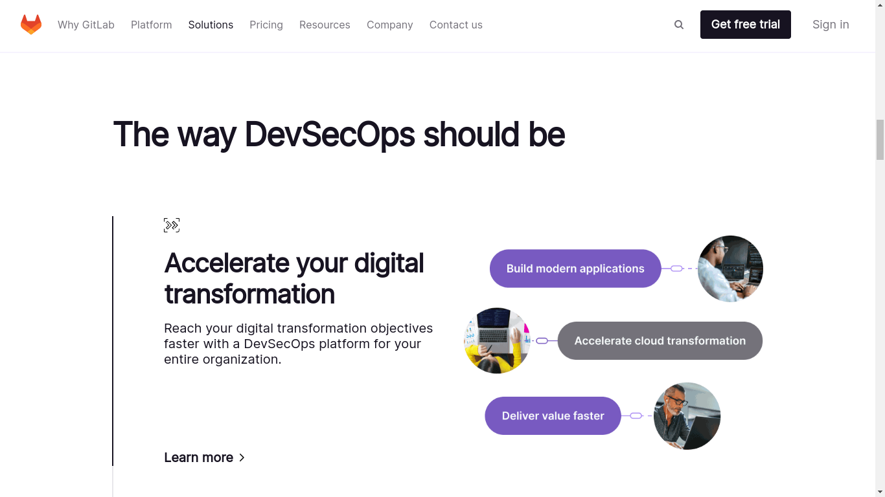

# GitLab Home Page Clone


This project is an academy project. This's made to evaluate
my level in native web development languages; test my
capacity to build advanced user interfaces with HTML,
CSS and JavaScript only and learn more things about
those technologies. It's a front-end project only.
No any back-end API is called. The main goal of
the project is to reproduce the old GitLab home
page only to increase my level in HTML, CSS and
JavaScript as well as DOM manipulation.

## Access links
This project is already hosted on web and can be
accessible through one of these links below:<br/>
- https://www.google.com
- https://www.google.com
- https://www.google.com

## Final result
This is the final result of the project:<br/><br/>
### Video


### Screenshots




## Project installation
⚠️ This project uses some nodejs packages for
code minification, css purge and auto prefixer
for his production phase.
If you want to use <i><u></u></i>
to open the project sources, you can skip all
steps before clone the project sources code
and also dependencies installation whether
you want. Otherwise, <b><i>it's mandatory
to follow the steps below</i></b>.

### <u>Install curl</u>:
```sh
sudo apt install curl
```

### <u>Install nodejs</u>:
```sh
cd ~;\
curl -sL https://deb.nodesource.com/setup_16.x -o /tmp/nodesource_setup.sh;\
sudo bash /tmp/nodesource_setup.sh;\
sudo apt install nodejs;\
node -v
```

### <u>Sources code cloning</u>:
```sh
git clone git@github.com:obrymec/gitlab_home_page_clone.git home_page/
```

### <u>Install dependencies</u>:
Go to the root folder of the project sources
and run:
```sh
yarn install
```

### <u>Run project</u>:
Whether the project sources is opening with
<i><u></u></i>,
follow the steps below:

- Make sure that your computer is connected
to Internet;
- Go to extensions section and tap `live server`
within extensions search bar;
- Then, install it. After installation, close
your <i><u></u></i>
and open it again;
- When that is done, open `index.html` file
inside `./public/index.html` and make a right
click;
- In the displayed contextual menu, click on
`Open with Live Server...`

Whether you don't using <i><u></u></i>,
go to the root folder of the project and run:
```shs
yarn start
```
Then, open your favorite browser and tap on
the search bar, the following link:
```sh
http://localhost:5000/
```

Enjoy :)
